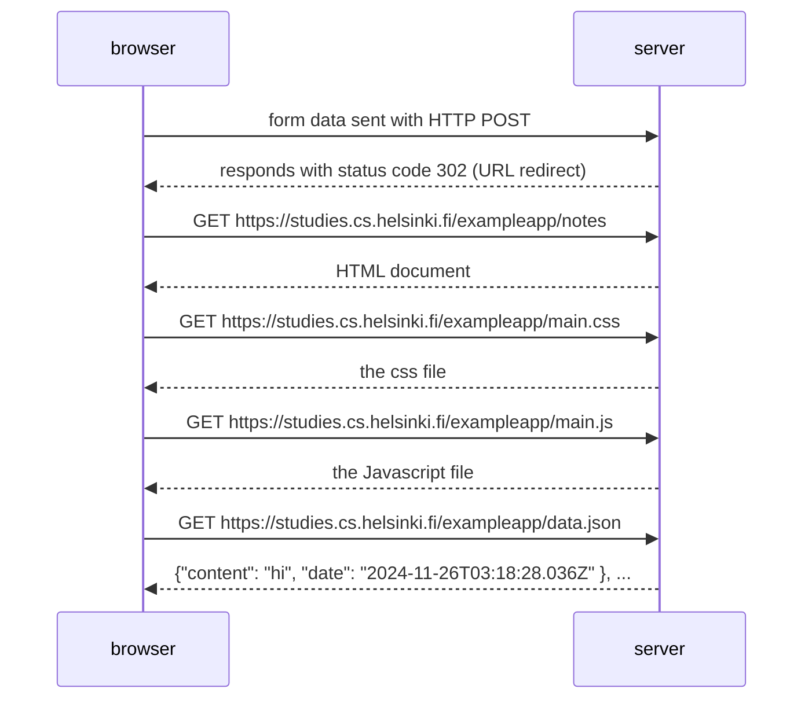

```mermaid 
sequenceDiagram
    participant browser
    participant server
browser->>server: form data sent with HTTP POST
server-->>browser: responds with status code 302 (URL redirect)
browser->>server: GET https://studies.cs.helsinki.fi/exampleapp/notes
server-->>browser: HTML document
browser->>server: GET https://studies.cs.helsinki.fi/exampleapp/main.css
server-->>browser: the css file
browser->>server: GET https://studies.cs.helsinki.fi/exampleapp/main.js
server-->>browser: the Javascript file
browser->>server: GET https://studies.cs.helsinki.fi/exampleapp/data.json
server-->>browser:   {"content": "hi",      "date": "2024-11-26T03:18:28.036Z" }, ...
```