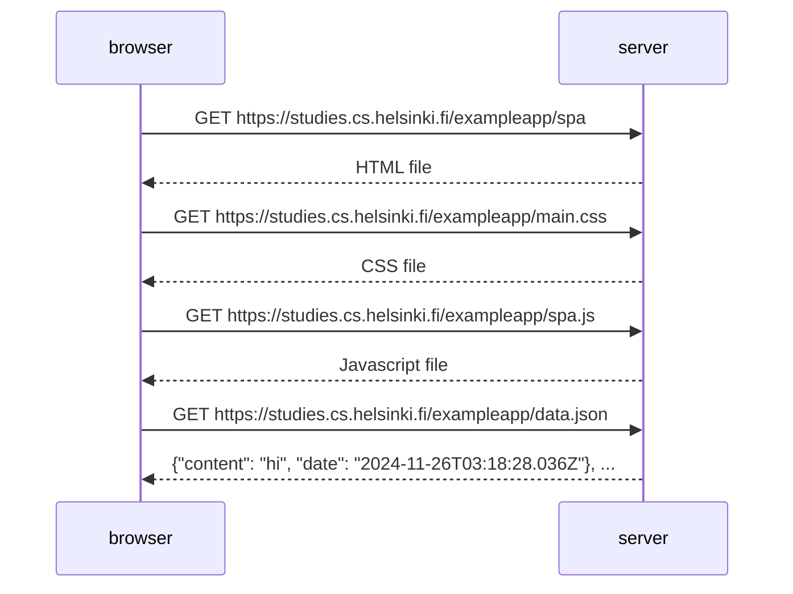

```mermaid
sequenceDiagram
    participant browser
    participant server
browser->>server: GET https://studies.cs.helsinki.fi/exampleapp/spa
server-->>browser: HTML file
browser->>server: GET https://studies.cs.helsinki.fi/exampleapp/main.css
server-->>browser: CSS file
browser->>server: GET https://studies.cs.helsinki.fi/exampleapp/spa.js
server-->>browser: Javascript file
browser->>server: GET https://studies.cs.helsinki.fi/exampleapp/data.json
server-->>browser: {"content": "hi",      "date": "2024-11-26T03:18:28.036Z"}, ...
```
